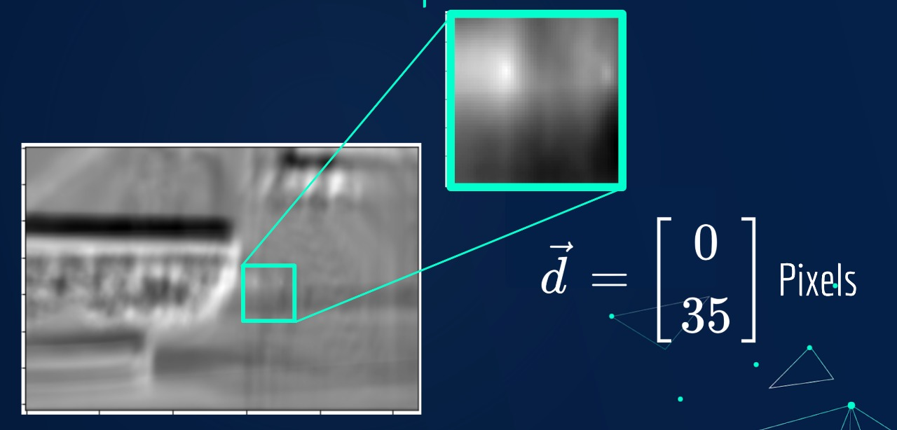
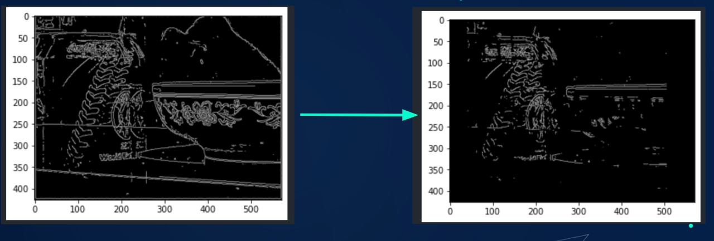
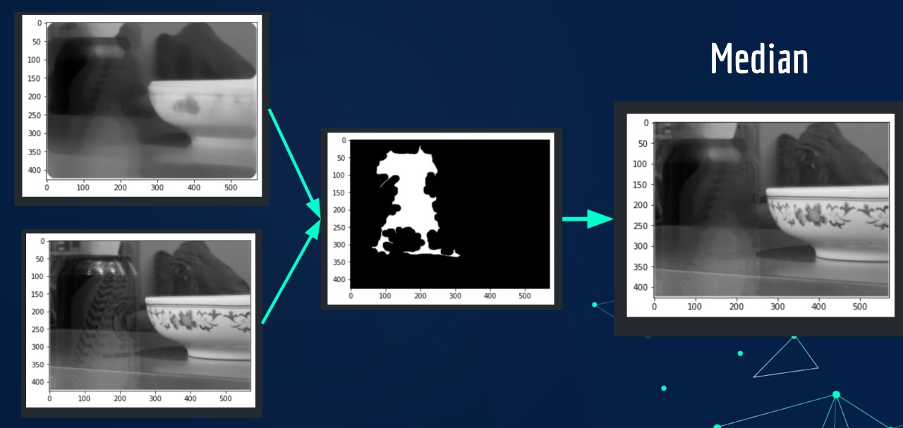
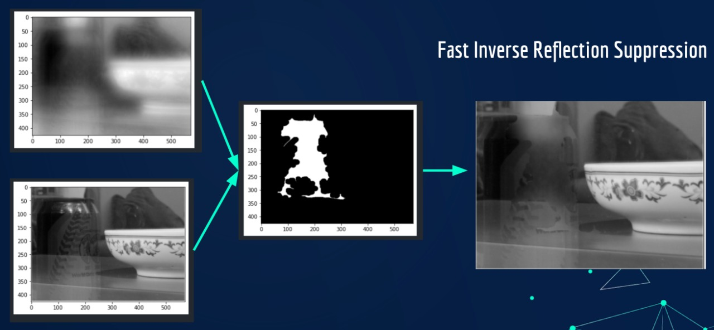

# Single image reflection removal using ghosting cues

---

- Aniketh Redimi
- Ashuthosh Bharadwaj
- Eshan Gupta
- Saravanan Senthil

---

Referenced from the paper: [Reflection Removal by Ghost Effect from A Single Image](https://citeseerx.ist.psu.edu/viewdoc/download?doi=10.1.1.358.761&rep=rep1&type=pdf)

installation:

```bash
git clone https://github.com/Digital-Image-Processing-IIITH/dip-project-photo.git
pip install opencv-python numpy matplotlib scipy tqdm
```

File and folder descriptions:
<!-- change this -->
- [complete_pipeline.ipynb](src/complete_pipeline.ipynb): Final notebook highlighting implementation of the paper.
<!--  -->
- [Fast single image reflection suppression](src/FastSingleImageReflectionSuppression): Custom implemented library to implement the paper sharing the same name.
- [Testing grounds](src/Testing_grounds.ipynb): Avenue for experimentation of methods.

```
.
├── README.md
├── documents
│   ├── DIP_Project_Slides.pdf
│   ├── ghost_hidden.pdf
│   └── proposal.pdf
├── guidelines.md
└── src
    ├── 1.ipynb
    ├── FastSingleImageReflectionSuppression
    ├── Testing_grounds.ipynb
    ├── complete_pipeline.ipynb
    ├── guiFSR.py
    ├── imgs
    └── utils.py
```

## Process

### Shift determination


### Gradient seperation


### Reconstruction with median


### Reconstruction with inverse FSR


## Fast single reflection removal using convex optimization

### result


### GUI
