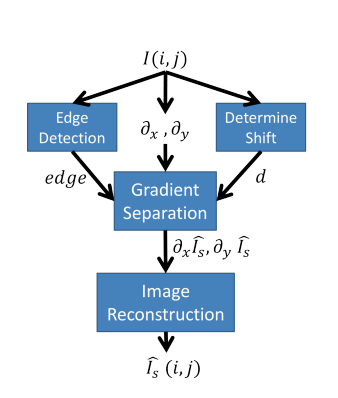

# Reflection Removal by Ghost Effect from A Single Image 

## Project Number: 11 

### [Github link](https://github.com/Digital-Image-Processing-IIITH/dip-project-photo.git)

--- 
### Team Photo

### Team Members -
- Eshan Gupta (2019102044)
- Saravanan Senthil (2019101016)
- Ashuthosh Bharadwaj (2019112003)
- Aniketh Reddimi (2018102014)

## Objective -

The objective of this project is to remove the reflection caused while taking images through the glass by performing some image processing on the raw image and obtaining a clearer image. 

## Problem Statement -

The images taken through glasses have undesired reflections due to reflection from glasses. The reflected image imposes what is termed as the “ghost effect”, on the digital image which can be used to distinguish between original and reflected images. This can be helpful in developing an algorithm that takes into consideration various image processing techniques in order to obtain the original image. The idea of the algorithm revolves around the separation of scene gradient and the reflection gradient and then reconstructing the scene image using scene gradient. 

Image Model - 

$$ I(\overrightarrow{x}) = I_s(\overrightarrow{x}) +  \sum_{i} I_{r,i}(\overrightarrow{x}) + \beta I_{r,i}(\overrightarrow{x} - \overrightarrow{d_{i}}) $$

where , 

$I_s(\overrightarrow{x})$ is the scene image,  
$I_{r,i}(\overrightarrow{x})$ is the reflection image of the $i^{th}$ object  
$\beta$ is the intensity attenuation caused by the glass  
$d_i$ is the shift of the reflection image of the $i^{th}$ object  

In the scope of this paper, only single reflection object has been considered so our model changes to -
$$ I(\overrightarrow{x}) = I_s(\overrightarrow{x}) + I_{r}(\overrightarrow{x}) + \beta I_{r}(\overrightarrow{x} - \overrightarrow{d}) $$

The parameters $\beta$ and $d$ are dependent on the glass properties and camera angle respectively. 

FlowChart: 

## Expected results
We aim to be able to remove reflected objects from images

## Milestones
$13^{th}$ November: Get familiar with image modelling and lookup references to get hold of algorithm

$29^{th}$ November: Final Deliverable

## Datasets required
Datasets not really required as there is no model to be trained. We can obtain images required from google images or elsewhere.